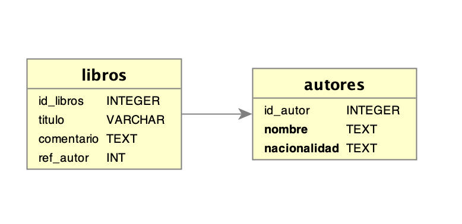

A lo largo del dia de hoy, trabajaremos con datos biológicos, de la base de datos de proteinas [Uniprot](http://www.uniprot.org/). De esta base de datos recopilaremos un par de entradas y las insertaremos en la base de datos.
Con estos datos de prueba, introduciremos la importancia de la creación de las tablas con claves primarias, únicas y con referencias.
Si una base de datos tiene unas tablas bien definidas, su mantenimieto y actualización se hace de forma muy sencilla. Si esto no es así, cada actualización, puede ser una pesadilla.

> ## 1. Clave única | primaria
>Clave única
>La clave única o `UNIQUE` hace que en la columna que la posee no pueda tener dos datos iguales. Es decir en cada registro, el campo marcado con UNIQUE debe tener un dato diferente. Esto lo convierte en un identificador del registro, ya que no puede haber dos registros que contengan el mismo dato en esa columna.
>Puede haber varias claves únicas en una tabla.
>
>La clave única la podemos marcar al crear la tabla, por ejemplo:
> ~~~
> CREATE TABLE miagenda (
>      nombre VARCHAR(255) NOT NULL,
>      telefono1 INT NOT NULL UNIQUE,
>      telefono2 INT,
>      email VARCHAR(255) NOT NULL UNIQUE
>      );
> ~~~
> {: .sql}
>
>Vemos en este ejemplo cómo al crear la tabla "miagenda" los campos "telefono1" y "email" les hemos asignado una clave única mediante la palabra reservada "UNIQUE". Les hemos asignado también la restricción `NOT NULL`, aunque no es obligatorio, es conveniente hacerlo así, de otra manera en el campo sólo se permitiría un registro con valor nulo (ya que otro registro nulo se consideraría repetido).
>En una tabla ya creada, podemos añadir un registro único a un campo ya existente, o que creamos más tarde, indicandolo en la instrucción `ALTER TABLE` de la siguiente manera:
>
> ~~~
> ALTER TABLE miagenda
>    ADD direccion VARCHAR(255),
>    ADD UNIQUE (direccion),
>    ADD UNIQUE (telefono2); 
> ~~~
> {: .sql}
>
>Creamos primero un nuevo campo en la tabla llamado "direccion", y después mediante "ADD UNIQUE (direccion)", lo convertimos en un campo con clave única. También añadimos una clave única al campo ya existente "telefono2", de la misma manera que para la anterior es decir mediante `ADD UNIQUE (telefono2)`.
>Cada una de estas instrucciones incluidas en "ALTER TABLE" irán separadas entre sí por comas.
>Para eliminar una clave unica utilizaremos la instrucción:
> ~~~
>ALTER TABLE nombre_tabla DROP INDEX nombre_columna;
> ~~~
> {: .sql}
>Es decir es otra instruccion dentro de `ALTER TABLE`. Lo de DROP INDEX es porque en realidad una clave única se considera un índice para buscar elementos en la tabla.
>
>
> La clave primaria, o **PRIMARY KEY** es el verdadero identificador de cada registro. Sólo puede haber una columna con clave primaria por tabla, y los registros deben ser también únicos, es decir no pueden estar repetidos ni ser nulos.
>La clave primaria es fundamental para crear relaciones entre varias tablas, ya que es esta clave la que identifica el registro que debe ser complementado con datos de otra tabla.
>
>Normalmente se crea una columna especial para incluir la clave primaria, que en la mayoría de las tablas llaman "id" o "id_nombretabla". Los valores de los registros suelen ser números enteros que identifican a cada uno de los registros que se crean en la tabla.
>Como habeis visto arriba, lo normal es crear las columnas de la tabla, y posteriormente indicamos mediante la instrucción `PRIMARY KEY` la columna que debe ser la clave primaria. 
> ~~~
>PRIMARY KEY (accnumber),
> ~~~
> {: .sql}
>Al crear esta columna debemos ponerle la instrucción **NOT NULL** para que pueda ser una clave primaria. No tendría lógica crear un campo de tanta importancia y permitir que sea **NULL**.
>Si tenemos una tabla ya creada, podemos indicar qué columna será la clave primaria mediante la instrucción:
> ~~~
>ALTER TABLE prueba1
>ADD PRIMARY KEY (id_prueba1)
> ~~~
> {: .sql}
>
>Para eliminar la clave primaria de una tabla utilizaremos la instrucción:
> ~~~
>ALTER TABLE nombre_tabla DROP PRIMARY KEY
> ~~~
> {: .sql}
>
>Cómo la clave primaria es única no necesitamos poner el nombre de la columna en la que está para eliminarla.
>
{: .callout}

> ## 2. Claves externas
>La clave externa crea una relación entre tablas, de forma que la columna a la que se le aplica se relaciona con la columna de la clave primaria de otra tabla. Por lo tanto para crear una clave externa necesitamos tener otra tabla con una clave primaria.
>Se crea una relación en la que en la que podemos obtener datos de la otra tabla que estén relacionados con la tabla actual. Por ejemplo si tenemos dos tablas, una para "autores" y otra para "libros", poniendo en la tabla "libros" una referencia externa a la tabla "autores" relacionamos a cada libro con su autor.
>Podemos crear una clave externa al crear la tabla, por ejemplo, suponemos que tenemos una base de datos "mislibros" y ahi crearemos dos tablas: "autores" y "libros". 
> ~~~
> CREATE TABLE autores(
>    id_autor INTEGER PRIMARY KEY AUTOINCREMENT, 
>    nombre text NOT NULL,
>    nacionalidad text NOT NULL
>);
> ~~~
> {: .sql}
> Hemos ya creado la tabla "autores" con una columna con la clave primaria llamada "id_autor". Creamos ahora la tabla "libros" con sus claves:
>
> ~~~
>CREATE TABLE libros (
>   id_libros INTEGER PRIMARY KEY AUTOINCREMENT, 
>   titulo VARCHAR(255),
>   comentario TEXT,
>   ref_autor INTEGER,
>   FOREIGN KEY (ref_autor) REFERENCES autores (id_autor)
>	ON DELETE CASCADE ON UPDATE CASCADE
>);
> ~~~
> {: .sql} 
>   
>Nos fijamos en la última línea que es la que crea la clave externa, su estructura es la siguiente:
> ~~~
>FORGEIN KEY (col_ref) REFERENCES otra_tabla (col_claveprimaria)
> ~~~
> {: .sql}
>
>Para ver el esquema más facilmente, incluimos una imagen:
>
>
>Vamos a ver como es el funcionamiento, para ello insertaremos unos datos:
>
> ~~~
>INSERT INTO autores VALUES( 1,"Juan Morientes","Colombiano");
>INSERT INTO autores (nombre, nacionalidad) VALUES("Paco Cepeda","Argentino");
>
> SELECT * FROM autores;
> ~~~
> {: .sql} 
>
>```
>id_autor    nombre          nacionalidad
>----------  --------------  ------------
>1           Juan Morientes  Colombiano  
>2           Paco Cepeda     Argentino   
>```
>
>Fijaos que en el segundo `INSERT` no estamos incluyendo el id, pero como es un campo con AUTOINCREMENT, para cada registro, el id se suma solo.
>Ahora insertamos datos en la tabla libros:
> ~~~
> INSERT INTO libros VALUES(1, "Paradysso", "Libro de ciencia ficción sobre marcianos", 1);
>
> ~~~
> {: .sql} 
> He guardado un nuevo libro, escrito por Juan Morientes, pero **ERROR!**, el escritor es Paco Cepeda !!!!!. Como hago para cambiarlo en la tabla libros ¿?
>
> ~~~
> sqlite> SELECT * from libros;
> ~~~
> {: .sql} 
>```
>id_libros   titulo      comentario                                ref_autor 
>----------  ----------  ----------------------------------------  ----------
>1           Paradysso   Libro de ciencia ficción sobre marcianos  1         
>```
> ~~~
>UPDATE libros SET ref_autor=2 where id_libros=1;
>sqlite> SELECT * from libros;
> ~~~
> {: .sql} 
> ```
>id_libros   titulo      comentario                                ref_autor 
>----------  ----------  ----------------------------------------  ----------
>1           Paradysso   Libro de ciencia ficción sobre marcianos  2         
>```
> En este caso sólo tenemos una tabla que depende de autores, pero si tuvieramos docenas, este cambio sería automatico.
> Como en nuestra relación externa incluimos "ON DELETE CASCADE ON UPDATE CASCADE", le decimos que los cambiso en una tabla se propaguen por las restantes que las referencian
> y si ademas se borra un registro, que se borre en todas las tablas dependendientes, de esta forma si borramos al autor 2 de la tabla autores, se borraran todos sus libros de la tabla libros:
> ~~~
> DELETE from AUTORES where id_autor=2;
> SELECT * FROM libros;
> ~~~
> {: .sql} 
> En el caso de que no se haya borrado y por lo tanto siga exisistiendo el libro, comprobad que el PRAGMA está activado y probad de nuevo:
> ~~~
> INSERT INTO autores VALUES(2, "Paco Cepeda","Argentino");
> PRAGMA foreign_keys = ON;
> DELETE from AUTORES where id_autor=2;
> SELECT * FROM libros;
> ~~~
> {: .sql} 
{: .callout}


> ## 3. Ejemplo biológico.
> Descargad el fichero [initial.sql]({{ page.root }}/files/initial.sql), copiadlo
> a vuestra carpeta de trabajo y abrirlo con un editor de texto. Vamos a repasar cada una de las sentencias que ahí aparecen, haciendo énfasis en las **claves primarias**, los **registros únicos** y las **referencias externas**:
>
>
>
> ~~~
> CREATE TABLE SWISSENTRY (
>         accnumber VARCHAR(10) NOT NULL,
>         id VARCHAR(25) NOT NULL,
>         lastupd DATE NOT NULL DEFAULT CURRENT_DATE,
>         description VARCHAR(1000),
>         seq TEXT NOT NULL,
>         molweight NUMERIC(9,0) NOT NULL,
>         PRIMARY KEY (accnumber),
>         UNIQUE (id)
> );
> 
> CREATE TABLE ACCNUMBERS (
>         main_accnumber VARCHAR(10) NOT NULL,
>         accnumber VARCHAR(10) NOT NULL,
>         PRIMARY KEY (main_accnumber,accnumber),
>         FOREIGN KEY (main_accnumber) REFERENCES SWISSENTRY (accnumber)
>                 ON DELETE CASCADE ON UPDATE CASCADE
> );
> ~~~
> {: .sql}
>
> 
> Tras haber leído y entendido el esquema que lo forma, incluiremos debajo de las sentencias `CREATE`, dos sentencias adicionales de `INSERT` de dos proteinas cualquiera, que se obtendrán del abrir dos veces el siguiente link de  [Uniprot](http://www.uniprot.org/uniprot/?query=*&random=yes) (una vez en la página, pinchad en Format->Text).
>
> Cuando ya tengais lo tengais, vamos a decirle a SQLite que lea este fichero y que ejecute los comandos SQL que hay en ese fichero. Recordad que eso lo vimos ayer. No olvideis que son dos tablas y en ambas hay que insertar los dos registros.
>
>
> Si no ha habido ningún error, tendréis dos resultados de la querie anterior. Cómo habeis visto, de esta forma podemos insertar varios registros de una vez. Pero aún así esto no es
> muy útil porque al fin y al cabo, tenemos que escribir toda la información en un fichero. ¿Qué pasaría si tenemos que insertar las proteínas de un organismos entero?.
> Pues esto lo veremos más adelante.
>
{: .callout}

